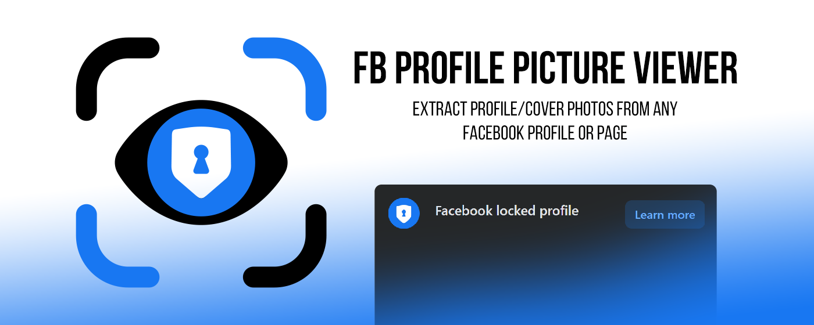

<table align="center">
  <tr>
    <td width="60"></td>
    <td><strong style="font-size: 20px;">FB Profile Picture Viewer</strong></td>
    <td></td>
  </tr>
</table>

  

 

**View, download, and upscale Facebook profile pictures and cover photos with a modern interface – right from your browser toolbar.**

<table align="center">
  <tr>
    <td align="center"> <b>Normal Profile</b></td>
    <td align="center"> <b>Private Profile</b></td>
</table>

## 🚀 Features

- 🔍 **Extract full‑size** profile pictures and cover photos from **any Facebook profile**
- 📥 **One‑click download** of original images
- 🖼️ **Interactive modal viewer** with zoom (mouse wheel) and pan (drag)
- ✨ **Local upscaling** (×2) using high‑quality **Lanczos interpolation** – no servers, no uploads
- 🌗 **Dark mode** (toggle and persistence)
- 🌐 **Multi‑language** (English / Spanish) – persistent preference

---

## 📦 Installation

### From the official stores (recommended)
- **Microsoft Edge Add‑ons** – [Get for Edge](https://microsoftedge.microsoft.com/addons/detail/kmpdgpmmofbjbojdfbjgfcajddalninl)
- **Chrome Web Store** – [ Coming Soon ]

### Manual installation (developer mode)
1. Clone this repository or download the [latest release](https://github.com/coccoa-sudo/fb-profile-picture-viewer/releases).
2. Open Chrome/Edge and go to `chrome://extensions` (or `edge://extensions`).
3. Enable **Developer mode** (toggle in top‑right).
4. Click **Load unpacked** and select the extension folder.
5. The extension icon will appear in your toolbar.

---

## 🕹️ How to use

1. Navigate to **any Facebook profile page** (your own, a friend’s, or a public page).
2. Click the extension icon in the toolbar.
3. The popup will automatically load:
   - **Profile picture** 
   - **Cover photo**
4. Use the buttons to:
   - **Download** the original image
   - **Upscale ×2** the profile picture (local Lanczos resampling)
   - **Click on any image** to open the modal viewer (zoom with mouse wheel, drag to pan)

> ⚠️ **Note:** The extension only works on **Facebook** domains. It cannot access private content that you wouldn’t normally see as a logged‑in user.

---

## 🛠️ Technical overview

- **Manifest V3** – fully compliant with modern Chrome/Edge extension requirements.
- **No external servers** – all processing (upscaling, extraction) happens locally.
- **Lanczos resampling** – high‑quality image upscaling with a 3‑lobe kernel (fallback to standard canvas if needed).
- **Persistent settings** – theme and language are saved using `chrome.storage.local`.

---

## 🤝 Contributing

Contributions are welcome! Feel free to open issues or pull requests.

1. Fork the repository.
2. Create your feature branch (`git checkout -b feature/amazing-feature`).
3. Commit your changes (`git commit -m 'Add some amazing feature'`).
4. Push to the branch (`git push origin feature/amazing-feature`).
5. Open a Pull Request.

---

## 📄 License

Distributed under the **MIT License**. See [`LICENSE`](LICENSE) for more information.

---

## 💖 Support the project

If you find this extension useful, consider buying me a coffee ☕:

Your support keeps the project alive and motivated.

---

## 👨‍💻 Author

**Coccoa** – [GitHub](https://github.com/coccoa-sudo)

---

*Last updated: June 2026*
